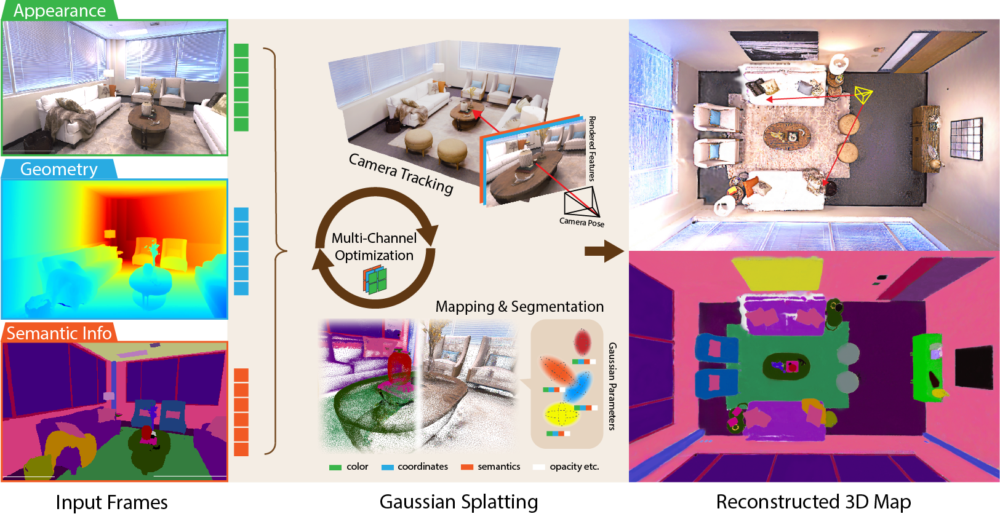

<!-- PROJECT LOGO -->

<p align="center">

  <h1 align="center">SGS-SLAM: Semantic Gaussian Splatting For Neural Dense SLAM</h1>
  <h3 align="center">ECCV 2024</h3>
  <p align="center">
    Mingrui Li*, Shuhong Liu*, Heng Zhou, Guohao Zhu, Na Cheng, Tianchen Deng, Hongyu Wang
  </p>
  <p align="center">
    (*equal contribution)
  </p>
  <h3 align="center"><a href="https://arxiv.org/pdf/2402.03246">Paper</a> | <a href="https://www.youtube.com/watch?v=y83yw1E-oUo">Video</a> | <a href="https://www.dropbox.com/scl/fo/a93xhcpsteumsmw8oq4jc/ALD5oq6MfkKTpT_7K5cDqhQ?rlkey=hblzvi1m9pcqmksgzs9ydwdxp&st=uvjz1fec&dl=0">Replica Dataset</a>
  <div align="center"></div>
</p>

<p align="center">
  <a href="">
    
  </a>
</p>

<br>

## Table of Contents
<!-- TABLE OF CONTENTS -->
<details open="open" style='padding: 10px; border-radius:5px 30px 30px 5px; border-style: solid; border-width: 1px;'>
  <summary>Overview</summary>
  <ol>
    <li>
      <a href="#abstract">Abtract</a>
    </li>
    <li>
      <a href="#installation">Installation</a>
    </li>
    <li>
      <a href="#download-dataset">Download Dataset</a>
    </li>
    <li>
      <a href="#usage">Usage</a>
    </li>
    <li>
      <a href="#saving-and-visualization">Saving and Visualization</a>
    </li>
    <li>
      <a href="#logging">Logging</a>
    </li>
    <li>
      <a href="#acknowledgement">Acknowledgement</a>
    </li>
    <li>
      <a href="#citation">Citation</a>
    </li>
  </ol>
</details>

## Abstract

We present SGS-SLAM, the first semantic visual SLAM system based on [3D Gaussian Splatting](https://github.com/graphdeco-inria/gaussian-splatting). It incorporates appearance, geometry, and semantic features through multi-channel optimization, addressing the oversmoothing limitations of neural implicit SLAM systems in high-quality rendering, scene understanding, and object-level geometry. We introduce a unique semantic feature loss that effectively compensates for the shortcomings of traditional depth and color losses in object optimization. Through a semantic-guided keyframe selection strategy, we prevent erroneous reconstructions caused by cumulative errors. Extensive experiments demonstrate that SGS-SLAM delivers state-of-the-art performance in camera pose estimation, 3D map reconstruction, precise semantic segmentation, and object-level geometric accuracy, while ensuring real-time rendering capabilities.

<p align="center">
  <a href="">
    
  </a>
</p>

## Installation

```bash
conda create -n sgs-slam python=3.9
conda activate sgs-slam
conda install -c "nvidia/label/cuda-11.8.0" cuda-toolkit
conda install pytorch==2.0.1 torchvision==0.15.2 torchaudio==2.0.2 cudatoolkit=11.8 pytorch-cuda=11.8 -c pytorch -c nvidia
pip install -r requirements.txt
```

## Download Dataset

DATAROOT is `./data` by default. Please change the `input_folder` path in the scene-specific config files if datasets are stored elsewhere.

### Replica

You can download the Replica dataset with ground-truth semantic masks from [this link](https://www.dropbox.com/scl/fo/a93xhcpsteumsmw8oq4jc/ALD5oq6MfkKTpT_7K5cDqhQ?rlkey=hblzvi1m9pcqmksgzs9ydwdxp&st=uvjz1fec&dl=0). The original Replica scenes, created by the Meta research team, are accessible through their [official repository](https://github.com/facebookresearch/Replica-Dataset). By accessing the dataset via the provided link, you consent to the terms of the license. The ground-truth semantic masks were generated by us refering to the preprocessing procedure of [Semantic-NeRF](https://github.com/Harry-Zhi/semantic_nerf). Additionally, the camera trajectories in the dataset were captured using iMAP.


### ScanNet

Please follow the data downloading procedure on the [ScanNet](http://www.scan-net.org/) website, and extract color/depth/semantic frames from the `.sens` file using the following preprocessing step:

```bash
python preprocess/scannet/run.py --input_folder [input path] --output_folder [output path] --export_depth_images --export_color_images --export_poses --export_intrinsics --export_seg --label_map_file preprocess/scannet/scannetv2-labels.combined.tsv
```

<details>
  <summary>[Directory structure of ScanNet (click to expand)]</summary>

```
  DATAROOT
  └── scannet
        └── scene0000_00
            └── frames
                ├── color
                │   ├── 0.jpg
                │   ├── 1.jpg
                │   ├── ...
                │   └── ...
                ├── depth
                │   ├── 0.png
                │   ├── 1.png
                │   ├── ...
                │   └── ...
                ├── intrinsic
                └── pose
                    ├── 0.txt
                    ├── 1.txt
                    ├── ...
                    └── ...
```
</details>


We use the following sequences following the previous studies: 
```
scene0000_00
scene0059_00
scene0106_00
scene0181_00
scene0207_00
```

### ScanNet++

Please follow the data downloading and image undistortion procedure on the <a href="https://kaldir.vc.in.tum.de/scannetpp/">ScanNet++</a> website. 

We use the following sequences following [SplaTAM](https://github.com/spla-tam/SplaTAM): 

```
8b5caf3398
b20a261fdf
```

To extract the ground-truth semantic masks, please follow the guidelines on its [official repo](https://github.com/scannetpp/scannetpp)

## Usage

<p align="center">
  <a href="">
    
  </a>
</p>


We use the Replica dataset as an example. Similar approaches apply to other datasets as well.

Run the slam system:

```bash
python scripts/slam.py configs/replica/slam.py
```

Run the post optimization after the slam system:
```bash
python scripts/post_slam_opt.py configs/replica/post_slam_opt.py
```

Visualize the reconstruction in an online mannar:
```bash
python viz_scripts/online_recon.py configs/replica/slam.py
```

Visualize the final reconstructed scenes and manipulate the scene:

```bash
python viz_scripts/tk_recon.py configs/replica/slam.py
```

## Saving and Visualization

By default, the system stores the reconstructed scenes in `.npz` format, which includes both appearance and semantic features. Additionally, we save the final RGB and semantic maps in `.ply` format for easier visualization. You can view the scenes using any 3DGS viewer, such as [SuperSplat](https://playcanvas.com/supersplat/editor/). For interactive rendering, as illustrated above, we adopt the Open3D viewer from [SplaTAM](https://github.com/spla-tam/SplaTAM).

## Logging

We use [weights and biases](https://wandb.ai/) for the logging. To enable this, set the `wandb` flag to True in the configuration file and specify the `wandb_folder` path. Make sure to adjust the `entity` configuration to match your account. Each scene is associated with a config folder where you must define the `input_folder` and `output` paths. Setting `wandb=False` to disable the online logging.


## Acknowledgement

Our work is based on [SplaTAM](https://github.com/spla-tam/SplaTAM), and by using or modifying this work further, you agree to adhere to their terms of usage and include the license file. We extend our sincere gratitude for their outstanding contributions. We would also like to thank the authors of the following repositories for making their code available as open-source:

- [Dynamic 3D Gaussians](https://github.com/JonathonLuiten/Dynamic3DGaussians)
- [3D Gaussian Splating](https://github.com/graphdeco-inria/gaussian-splatting)
- [GradSLAM & ConceptFusion](https://github.com/gradslam/gradslam/tree/conceptfusion)
- [Semantic-NeRF](https://github.com/Harry-Zhi/semantic_nerf)
- [Nice-SLAM](https://github.com/cvg/nice-slam)
- [vMap](https://github.com/kxhit/vMAP)
- [ESLAM](https://github.com/idiap/ESLAM)
- [Point-SLAM](https://github.com/eriksandstroem/Point-SLAM)

## Citation

If you find our work useful, please kindly cite us:

```bib
@inproceedings{li2024sgs,
  title={Sgs-slam: Semantic gaussian splatting for neural dense slam},
  author={Li, Mingrui and Liu, Shuhong and Zhou, Heng and Zhu, Guohao and Cheng, Na and Deng, Tianchen and Wang, Hongyu},
  booktitle={European Conference on Computer Vision},
  pages={163--179},
  year={2024},
  organization={Springer}
}
```


